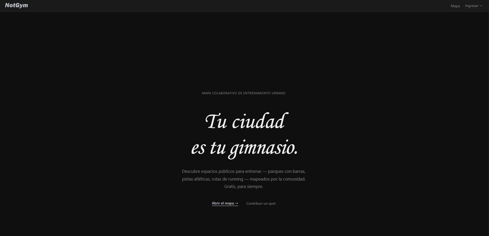
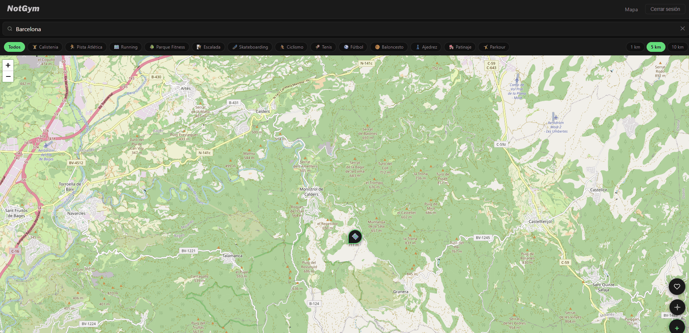
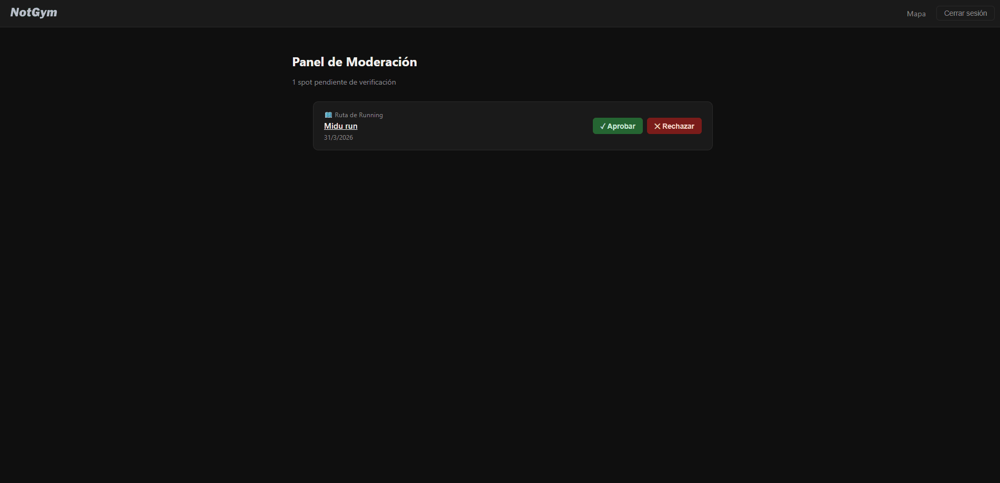

# NotGym

> El mejor gym es el que no te cobra.

NotGym es un mapa colaborativo para descubrir y contribuir spots de entrenamiento al aire libre y de acceso gratuito — zonas de calistenia, pistas atléticas, rutas de running, parques fitness y más.

**En vivo:** [notgym.org](https://notgym.org)



---

## Funcionalidades

- **Mapa interactivo** — Explorá spots verificados cerca tuyo, filtrados por categoría de entrenamiento
- **Páginas de detalle** — Fotos, descripción, dirección e información del contribuidor
- **Contribuir spots** — Los usuarios autenticados pueden agregar nuevos spots al mapa
- **Favoritos** — Guardá y revisá tus spots favoritos desde cualquier dispositivo
- **Subida de fotos** — Agregá fotos a cualquier spot existente
- **Rutas de running** — Trazá y guardá rutas directamente en el mapa con cálculo automático de distancia
- **Moderación** — Panel de admin para aprobar o rechazar spots enviados

---

## Demo

### Crear un spot


### Guardar favoritos


### Moderación (admin)


---

## Stack Tecnológico

| Capa | Tecnología |
|---|---|
| Frontend / SSR | Astro 5 (modo server) |
| Mapa Interactivo | Leaflet + OpenStreetMap |
| Trazado de Rutas | Leaflet Draw + Turf.js |
| Base de Datos | Supabase (PostgreSQL + PostGIS) |
| Almacenamiento | Supabase Storage |
| Autenticación | Supabase Auth (magic link + Google OAuth) |
| Deploy | CubePath (Docker / Node) |
| DNS / Proxy | Cloudflare |

---

## Cómo Empezar

### Requisitos Previos

- Node.js 20+
- Un proyecto en [Supabase](https://supabase.com) con PostGIS habilitado

### Instalación

```bash
npm install
```

### Variables de Entorno

Creá un archivo `.env` en la raíz del proyecto:

```env
PUBLIC_SUPABASE_URL=https://xxxx.supabase.co
PUBLIC_SUPABASE_ANON_KEY=eyJ...
SUPABASE_SERVICE_ROLE_KEY=eyJ...
PUBLIC_APP_URL=https://notgym.org
```

> `SUPABASE_SERVICE_ROLE_KEY` es exclusivamente server-side y nunca debe exponerse al cliente.

### Configuración de la Base de Datos

Ejecutá el esquema SQL en el editor SQL de Supabase usando el archivo [`supabase/schema.sql`](./supabase/schema.sql).

### Servidor de Desarrollo

```bash
npm run dev
```

### Build y Ejecución

```bash
npm run build
node ./dist/server/entry.mjs
```

---

## Despliegue (Docker)

```dockerfile
FROM node:20-alpine
WORKDIR /app
COPY package*.json ./
RUN npm ci
COPY . .
RUN npm run build
EXPOSE 3000
ENV HOST=0.0.0.0 PORT=3000
CMD ["node", "./dist/server/entry.mjs"]
```

---

## Estructura del Proyecto

```
src/
├── pages/
│   ├── index.astro              # Landing page
│   ├── app/
│   │   ├── map.astro            # Mapa interactivo
│   │   ├── favorites.astro      # Spots favoritos
│   │   ├── spots/[id].astro     # Detalle de spot
│   │   └── submit.astro         # Formulario de nuevo spot
│   ├── admin/
│   │   └── spots.astro          # Panel de moderación
│   └── api/
│       ├── spots/               # CRUD de spots
│       ├── favorites/           # Favoritos del usuario
│       ├── routes/              # Rutas de running
│       └── auth/                # Login / logout
├── components/
│   ├── MapView.tsx              # Isla React (client:only)
│   ├── SpotCard.tsx
│   └── FilterBar.tsx
├── layouts/
│   └── Layout.astro
├── lib/
│   └── supabase.ts
└── middleware.ts
```

---

## Roadmap

- [ ] Sistema de valoraciones y reviews por spot
- [ ] Integración con Overpass API de OSM para pre-poblar pistas existentes
- [ ] App móvil (React Native / Expo) con modo offline
- [ ] Gamificación: badges por spots agregados o rutas completadas
- [ ] Importar / exportar rutas en formato GPX
- [ ] Notificaciones cuando se agrega un spot cercano al usuario

---

*Hackathon build — NotGym v0.1*
